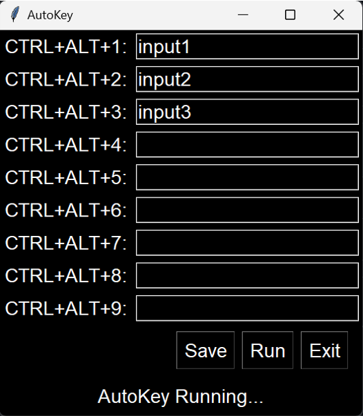
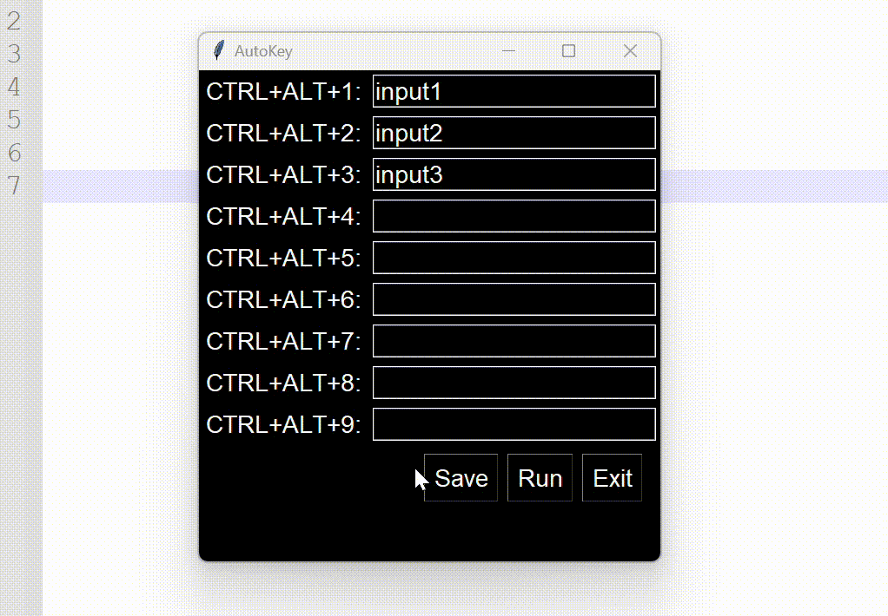
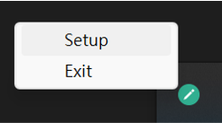

# AutoKey
AutoKey is a lightweight, installation-free hotkey tool that allows users to automate typing through customizable settings.

## Introduction

AutoKey is a lightweight, installation-free hotkey tool built with `tkinter`, `pynput`, and `pystray`. It enables users to implement automatic typing functionality through customizable settings.

## How to use

  1. Input area - Enter the text you want to automate.
  2. Save button - Saves your preferences to an `inputs.json` file in the same directory. The program will load this file each time it is opened.
  3. Run button - AutoKey will run in the background.

If needed, you can click the tray icon to reconfigure settings or exit the program.
